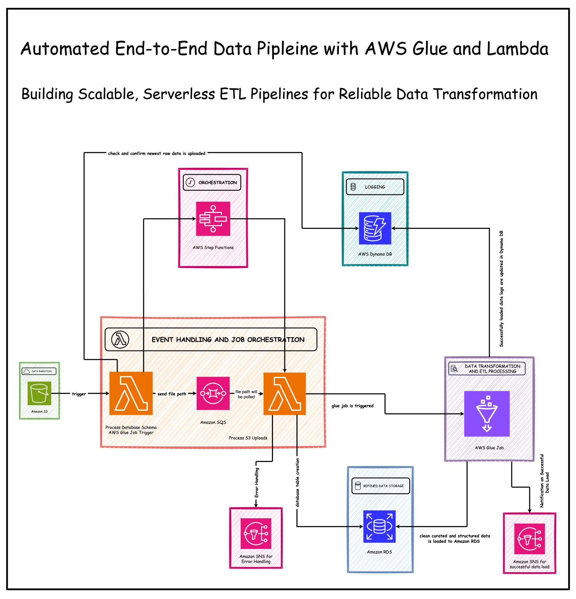

# end-to-end-aws-data-pipeline

🚀 Building a Robust End-to-End Data Pipeline with AWS Glue and Lambda       
   
I am excited to share that I’ve built an end-to-end, automated ETL pipeline that efficiently transforms raw data into structured, curated datasets. This loosely coupled solution leverages AWS Glue and Lambda to handle data ingestion, transformation, and storage in Amazon RDS, ensuring seamless, scalable, and fault-tolerant analytics and reporting.    

## Key AWS Services   
✅ Amazon S3: Acts as the ingestion layer triggering the pipeline.   
✅ AWS Lambda: Validates files, triggers workflows, analyzes data, creates RDS tables dynamically, and ensures data integrity.   
✅ AWS Glue: Transforms raw data, validates schemas, and loads curated datasets into RDS while updating logs in DynamoDB.   
✅ Amazon DynamoDB: Tracks timestamps for incremental loads and prevents reprocessing.   
✅ Amazon SNS: Sends real-time notifications for errors and successful executions. 

## Key Features   
🟠 **End-to-End Automation:** Automates the entire ETL process, from raw data ingestion to structured data storage in RDS, ensuring a seamless and efficient workflow.   
🟠 **Dynamic Schema Handling:** Analyzes raw data and creates RDS tables dynamically.   
🟠 **Incremental Loads:** Processes only new or updated data, optimizing efficiency.   
🟠 **Scalable Architecture:** Fault-tolerant and scalable, leveraging SQS, Step Functions, and Glue.   
🟠 **Data Quality Assurance:** Ensures schema-compliant, null-free, and duplicate-free datasets.   

## Takeaways    
💡 **Mastered Automation:** Strengthened my expertise in building automated ETL workflows that reduce manual effort and accelerate data processing timelines.    
💡 **Data Engineering Best Practices:** Gained deeper insights into schema design, data transformation strategies, and incremental loading techniques to ensure scalability and efficiency.   
💡 **AWS Expertise:** Expanded hands-on experience with AWS Glue, Lambda, RDS, SQS, and serverless computing, solving real-world challenges with cloud-native solutions.   

## 🟢 Let’s Connect!     
If you’re passionate about DevOps or curious about AWS automation, let’s connect! I’d love to exchange ideas, discuss strategies, or collaborate on exciting projects. Drop your thoughts in the comments!    
